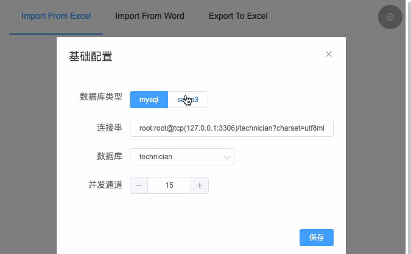

# data-extract

This is a data extraction widget. You can use it to import excel, word, and also export the result of submitting sql query statement queries as excel. Among them, word data is imported using [anko](https://github.com/mattn/anko) scripts for dynamic coding of data.

## showcase



## build

```sh
cd ui && yarn build && cd .. && mv web/index.html web/index.htm && go build
```
